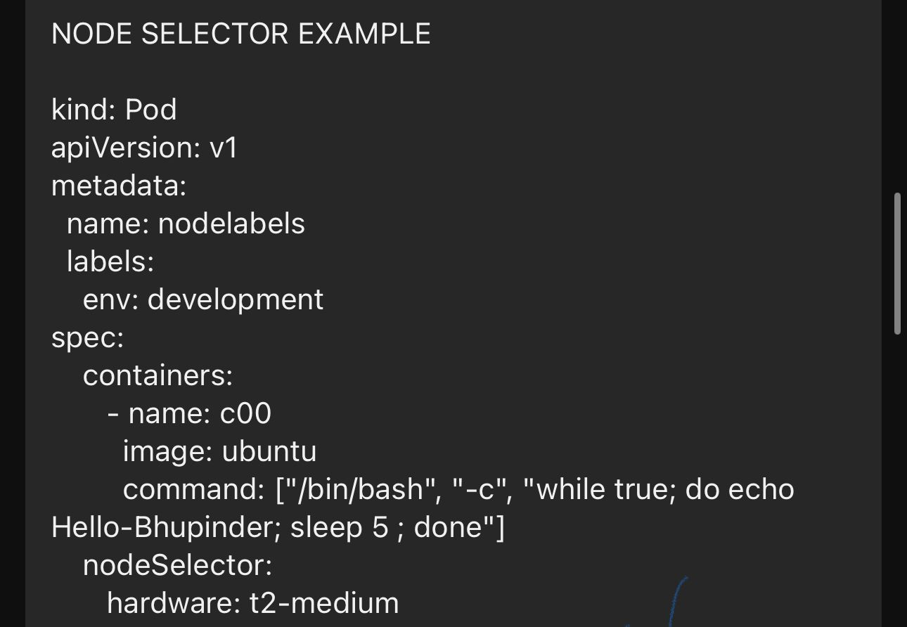
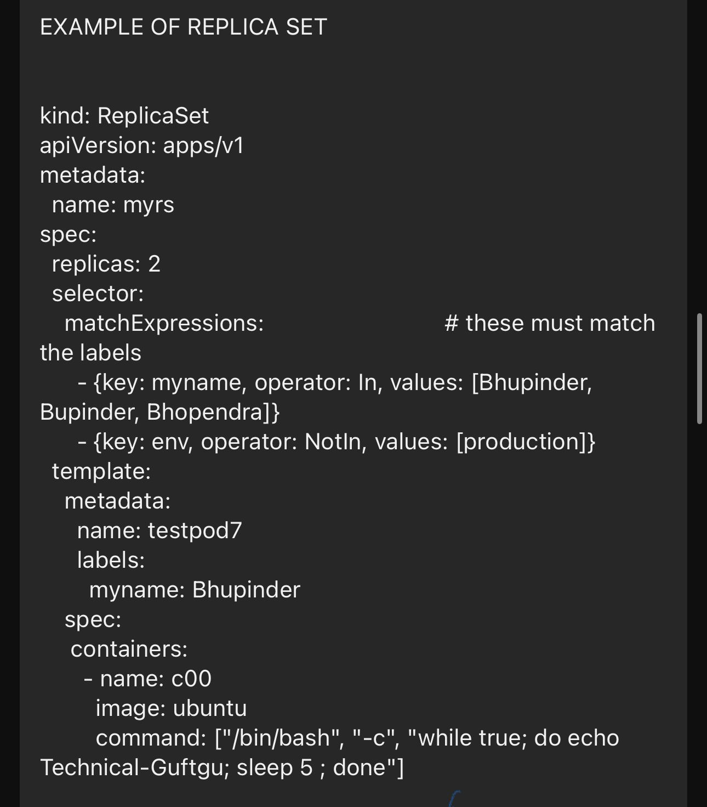

**LABELS**

- Labels are key-value pairs that are attached to Kubernetes objects such as pods, services, and nodes. They are used for identification and organizing resources.

- 

- EXAMPLE OF LABELS

- kind: Pod
- apiVersion: v1
-  metadata:
-   name: delhipod
-   labels:                                                   
-    env: development
-    class: pods
- spec:
-  containers:
-    - name: c00
-         image: ubuntu
-         command: ["/bin/bash", "-c", "while true; do echo Hello-Bhupinder; sleep 5 ; done"]

- #kubectl apply -f pod5.yaml
- #kubectl get po 

- #kubectl pods --show-labels

- #kubectl label pods delhipod mmyname=ashrika

- #kubectl get pods -l env=development

- #kubectl get pods -l env!=development

- #kubectl delete po -l env=development

- #kubectl get po -l 'env in(development,testing)'

**NODE SELECTOR**

- NodeSelector is a field in the PodSpec that specifies the nodes on which a pod can be scheduled. It uses labels on nodes to filter them.

- 

- kind: Pod
- apiVersion: v1
- metadata:
-  name: nodelabels
-  labels:
-    env: development
- spec:
-     containers:
-       - name: c00
-         image: ubuntu
-         command: ["/bin/bash", "-c", "while true; do echo Hello-Bhupinder; sleep 5 ; done"]
-    nodeSelector:                                         
-       hardware: t2-medium

- #kubectl apply -f pod6.yaml

- #kubectl get no 
- #kubectl label no wn1.tg.com hardware=t2.medium  (First we have to create a label)

- #kubectl get no -l t2-medium

- #kubectl label no wn2.tg.com hardware-  (to unlabel)

**REPLICA CONTROLLER**

- A ReplicationController ensures that a specified number of pod replicas are running at all times. It maintains the desired number of replicas by creating or deleting pods as needed.

- 

- Only supports equality-based selectors.

- #vi pod7.yaml
- kind: ReplicationController               
- apiVersion: v1
- metadata:
-  name: myreplica
- spec:
-  replicas: 2            
-  selector:        
-    myname: Bhupinder Rajput                             
-  template:                
-    metadata:
-      name: testpod6
-      labels:            
-        myname: Bhupinder
-    spec:
-     containers:
-       - name: c00
-         image: ubuntu
-         command: ["/bin/bash", "-c", "while true; do echo Hello-Bhupinder; sleep 5 ; done"]

- #kubectl apply pod7.yaml

- #kubectl get rc

- #kubectl describe rc myreplica
- #kubectl get pods 
- #kubectl get pods --show-labels

- #kubectl scale --replicas=8 rc -l myname=bhupinder
- #kubectl scale --replicas=1 rc -l myname=bhupinder

- #kubectl delete -f myrc.yml

**REPLICA SET**

- A ReplicaSet is an essential Kubernetes resource for maintaining the desired state of pod replicas, ensuring high availability and scalability of applications. It automatically replaces failed pods and can be scaled up or down based on requirements.

- 

- Supports both equality-based and set-based selectors, allowing for more complex and powerful selection criteria.

- #vi rs.yaml
- kind: ReplicaSet                                    
- apiVersion: apps/v1                            
- metadata:
-  name: myrs
- spec:
-  replicas: 2  
-  selector:                  
-    matchExpressions:                             # these must match the labels
-      - {key: myname, operator: In, values: [Bhupinder, Bupinder, Bhopendra]}
-      - {key: env, operator: NotIn, values: [production]}
-  template:      
-    metadata:
-      name: testpod7
-      labels:              
-        myname: Bhupinder
-    spec:
-     containers:
-       - name: c00
-         image: ubuntu
-         command: ["/bin/bash", "-c", "while true; do echo Technical-Guftgu; sleep 5 ; done"]

- #kubectl apply -f rs.yml

- kubectl get rs

- #kubectl get pods -l Bhupinder

- #kubectl scale --replicaset=1 rs 

- #kubectl get pods 

- #kubectl get rs 
