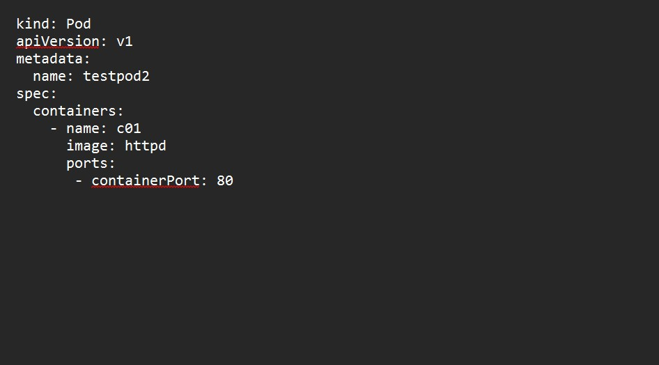
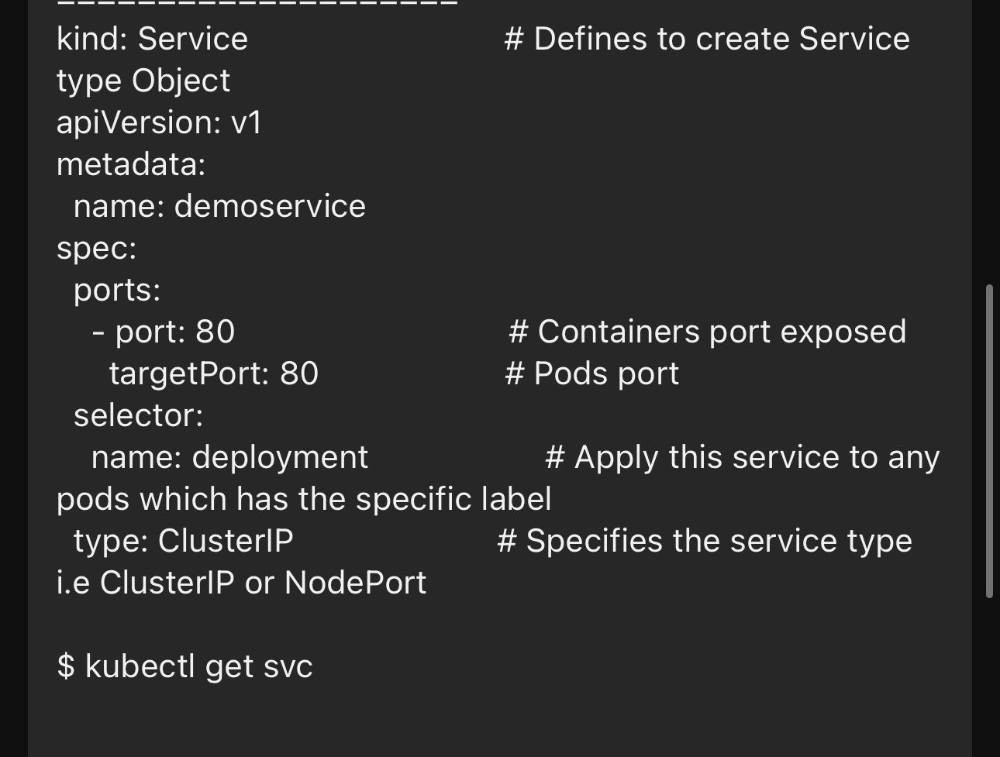
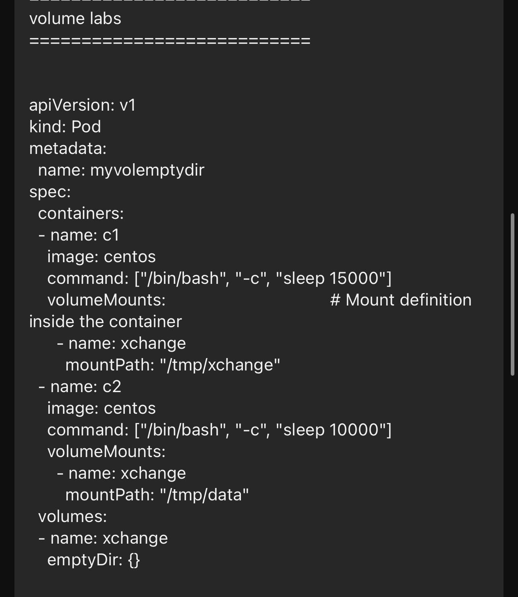
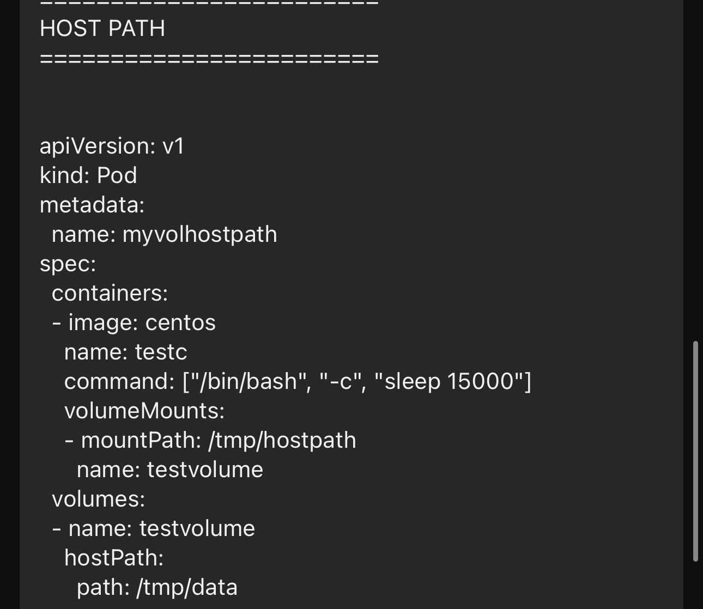

**Networking**

- Container to container communication on same pod happens through local host within the container

- 

- kubectl apply -f pod2.yaml

- kubectl get pods

- kubectl exec -it testpod -c c00 bash

- apt update && apt-get install curl  (RUN THIS COMMAND INSIDE THE CONTAINER)

- curl localhost:80

**NOW WE ARE TRYING TO ESTABLISH THE CONNECTION B/W TWO DIFFERENT PODS WITHIN SAME MACHINE**

- POD TO POD communucation on same worker node b/w happens through POD ip 

- vi POD1.yaml

- 

- kubectl apply -f pod1.yaml

- vi POD2.yaml

- 

- kubectl apply -f POD2.yaml

- kubectl get pods -o wide

- curl paste the <pod1IP>:containerPort

- curl paste the <pod2IP>:containerPort

**SERVICE (OBJECT)**

- service object is a logical bridge in b/w pods and end users which provides VIP(VIRTUAL IP)

- VIP is not a actual IP connected to network interface but its purpose is purely to forward a traffic to one or more pods

- services helps to expose the VIP mapped to the pods and allows applicationn to receive traffic

- LABELS are used to select which are the pods to be put under a service

- Services can be exposed in diff ways by specifying a type:
- 1) CLUSTER IP
- 2) NODE PORT

- vi deployment.yaml

- 

- kubectl apply -f deployment.yaml

- kubectl get po -o wide

- curl <pastePODIP>:containerport 

- vi service.yaml  (clusterIP)

- 

- kubectl apply -f service.yaml

- kbectl get svc

- curl <use that clusterIP to communicate>:<containerport>

- kubectl delete -f service.yaml

**NODE-PORT**

- In Kubernetes, the NodePort is a type of Service that exposes an application running on a set of Pods to the external network by opening a specific port on each Node in the cluster

- vi deployment.yaml (NODE PORT)

- 

- kubectl apply -f deployment.yaml

- vi service.yaml

- 

- kubectl apply -f service.yaml
- kubectl get svc

- kubectl describe svc demoservice

- NOW COPY EC2 DNS WITH PORT ON GOOGLE

**VOLUMES**

- In k8s volume is attached to a pod and shared among the containers of that pod 

- Basically,container volume is stored in the POD and if we have 3 container than we can mount specific vol to all 3 containers.

- vi volumemap.yaml

- 

- kubectl apply -f volumemap.yaml

- kubectl get pods

- kubectl exec -it myvolemptydir -c c1 bash

- NOW WE ARE INSIDE THE CONTAINER

- cd /tmp/exchange
- (now create any file )
- vi abc.txt
-  hello its me

- (NOW GO TO THE ANOTHER CONTAINER)

- kubectl exec -it myvolemptydir -c c2 bash

- (indide the container)

- cd /tmp/data
- vi laptop.txt
-  welcome to coredge.io

- NOW CROSS CHECK BOTH THE CONTAINER IN THEIR MOUNTPATH

**HOSTPATH**

- Use this when we want to access the content of a POD/CONTAINER from hostmachine

- A hostpath volume mounts the file or directory from the host's node filesystem into your POD

- vi hostpath.yaml

- 

- kubectl apply -f hostpath.yaml
- kubectl exec -it myvolhostpath -c testc bash

- (NOW YOU ARE INSIDE THE CONTAINER)
- cd /tmp/hostpath

- exit the container

- cd /tmp/data  (ON A HOST)

(YOU CAN ADD ANY FILE ON HOST THEN IT WILL AUTOMATICALLY SYNC TO CONTAINER VOL)

