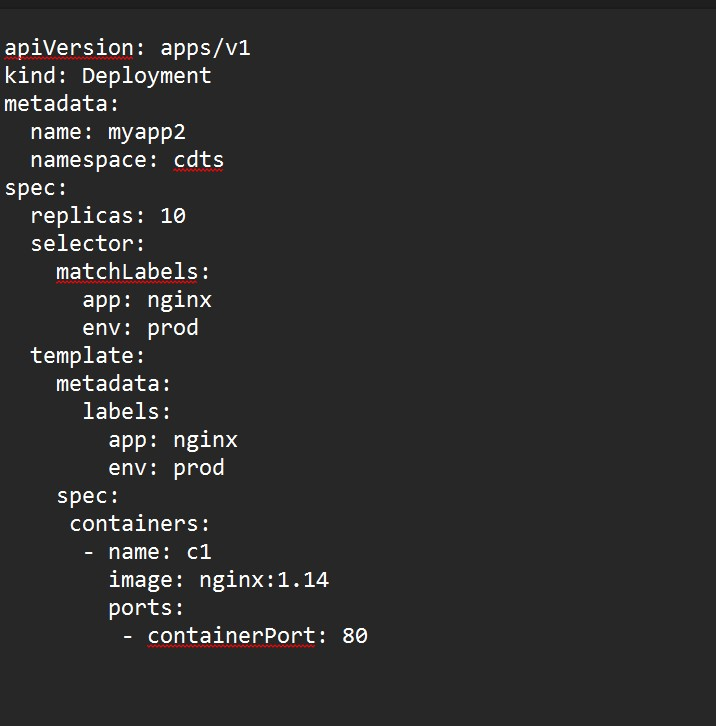

**DEPLOYMENT**

- Deployment  -->  Rolling upding + Roll back   (prod)

- Migration of Pods :
-    - Its an API-resource of k8s likewise pod, rs
-	- Deployment --->  it supports rolling update and rollback which not allowed in replicaset.
-	- To avoid manually migration of s/w version in deployment. 
-	- Replica Set is the base of Deployment resource.
-	- Its namespace oriented resource of k8s 

- vi deploy-test.yaml

- 

- kubectl apply -f deply-test.yaml

- kubectl  get all  -n cdts 

- kubectl set image deployment myapp2 c1=nginx:1.15  -n cdts --record

- kubectl set image deployment myapp2 c1=nginx:1.16  -n cdts --record

- kubectl set image deployment myapp2 c1=nginx:1.17  -n cdts --record

- kubectl  rollout history deployment myapp2 -n cdts (check revision history )

- kubectl rollout undo deployment myapp2 -n cdts --to-revision=4  

- crictl ps -a
 (to check the container on worker nodes)